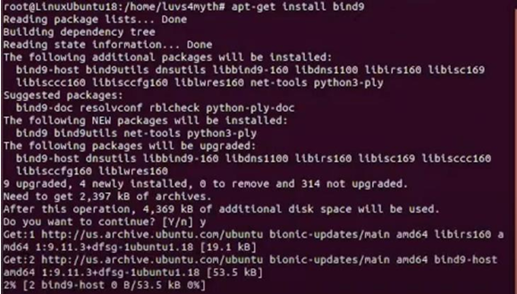
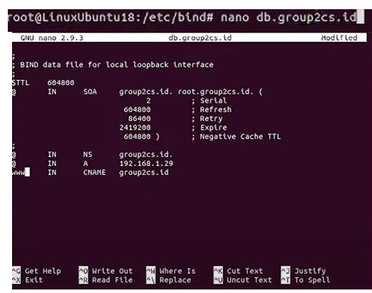
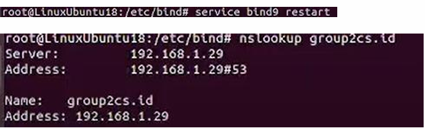
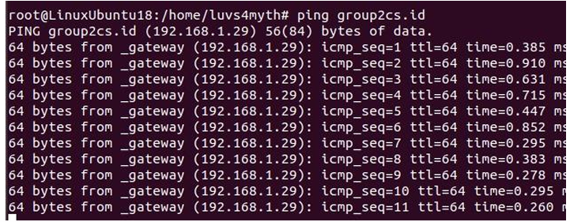
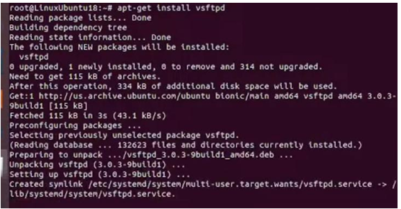
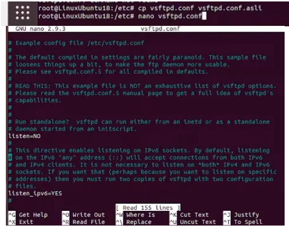
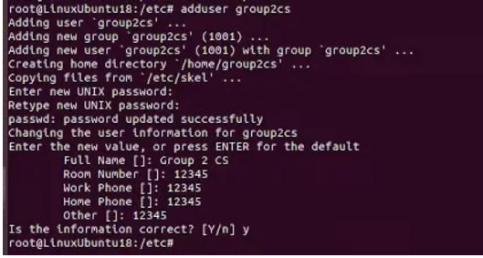
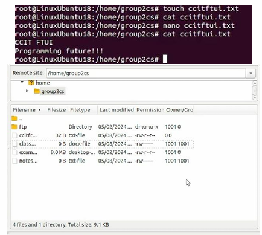

# Linux-Server-Project

This project focuses on setting up a DNS server and an FTP server using Linux Ubuntu 18.04. The objective was to simulate file transfer and domain resolution between two Linux systems in a controlled internal network environment using VirtualBox.

[View Full Project Report (PDF)](Linux_Project.pdf)

## Project Highlights
- Installed and configured Bind9 DNS service.
- Set up a vsftpd FTP server for file sharing.
- Connected two Ubuntu systems using an internal network setup.
- Verified DNS resolution and FTP file transfers using Filezilla and terminal commands.

---

## Key Outcomes
- Successfully configured a working DNS server on Linux Ubuntu.
- Set up FTP services allowing secure file sharing between devices.
- Achieved domain-based communication, reducing dependency on static IP addresses.
- Validated the setup through practical tests using Filezilla and terminal-based transfers.

---

## Tools Used
- Oracle VirtualBox
- Linux Ubuntu 18.04
- Windows 11
- Filezilla FTP Client
- Cisco Packet Tracer (for basic simulation references)

---

## Project Steps

### 1. DNS Server Configuration
Installed Bind9 on the server machine and configured the DNS service. Set up the server's IP address manually and modified DNS settings to create a functioning domain name server for the internal network.

> **Figure 1:** Bind9 DNS service configuration and network adapter setup.

Setup the DNS server in the interface

> **Figure 2:** Setup the DNS service interface.

DNS testing

> **Figure 3:** DNS Test.

Ping DNS server from client

> **Figure 4:** Ping the server from the client.

---

### 4. FTP Server Setup
Installed and configured the vsftpd FTP server on the Linux server. Edited the FTP configuration file, created a dedicated FTP user, and set appropriate access permissions.

Download vsftpd to start configuring FTP server

> **Figure 5:** vsftpd FTP server installation and user configuration.

Set up the FTP server

> **Figure 6:** vsftpd FTP server installation and user configuration.

Create FTP users

> **Figure 7:** FTP server user configuration.

---

### 5. Testing and Verification
Tested DNS server functionality by pinging the server using the configured domain name. Verified FTP services by logging into the server via Filezilla and transferring files successfully.

> **Figure 8:** Successful DNS resolution.

> **Figure 9:** FTP file transfer between server and client.

---

> _"Automating server configurations for a seamless digital experience."_
